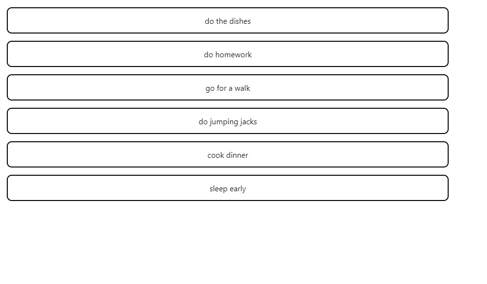
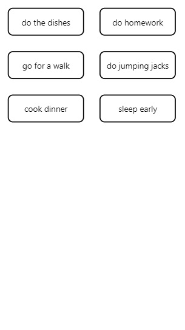

# responsive-component
Switch between mobile mode and desktop mode instantly using the size of the window. 


## Install

`npm install @smackchat/responsive-component` or `yarn add @smackchat/responsive-component`

## Usage
In this example, we create an app that features a mobile version component and a desktop version component. 
```js
import React, { Component } from 'react';
import { DesktopView } from './DesktopView';
import { MobileView } from './MobileView';

class App extends Component {
  render(){
    return (
      <div className="App">
        <DesktopView />
        <MobileView />       
      </div>
    );
  }
}

export default App;
```

Here are what the components look like. The desktop version is on the left and the mobile version is on the right.

  

Next, we import responsive-component. Create a variable which passes the `App` class inside `responsiveComponent()`. This is the variable we are exporting instead of the `App` class.

```js
import React, { Component } from 'react';
import { DesktopView } from './DesktopView';
import { MobileView } from './MobileView';
import { responsiveComponent } from './responsive-component';

const App = responsiveComponent(
  class App extends Component {
    render(){
      return (
        <div className="App">
          <DesktopView />
          <MobileView />  
        </div>
      );
    }
  }
);

export default App;
```

Lastly, we will use the `isMobile` property to render only one of the two components at a given window size. The app renders the mobile version if the current window size is small enough to fit inside a mobile device. Otherwise, the app renders the desktop version.

```js
import React, { Component } from 'react';
import { DesktopView } from './DesktopView';
import { MobileView } from './MobileView';
import { responsiveComponent } from './responsive-component';

const App = responsiveComponent(
  class App extends Component {
    render(){
      const { isMobile } = this.props;
      console.log('Is mobile? ', isMobile);
      return (
        <div className="App">
          {
            isMobile ? <MobileView /> : <DesktopView />
          }
        </div>
      );
    }
  }
);

export default App;
```
Courtesy of Chrome's dev tools, we can see how the app changes between mobile view and desktop view by shrinking and expanding the dimensions.

