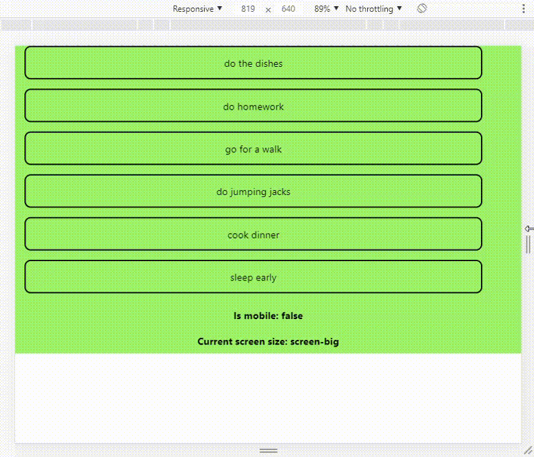

# responsive-component
Switch between mobile mode and desktop mode instantly using the size of the window. 

## Install

`npm install @smackchat/responsive-component` or `yarn add @smackchat/responsive-component`

## Usage
In this example, we create an app that features a mobile version component and a desktop version component. 

We create a variable which passes the `App` class inside `responsiveComponent()`. This is the variable we are exporting instead of the `App` class.

```js
import React, { Component } from 'react';
import { responsiveComponent } from './responsive-component';
import { DesktopView } from './DesktopView';
import { MobileView } from './MobileView';
import './App.css';

const App = responsiveComponent(
  class App extends Component {
    render(){
      const { isMobile, sizeClass } = this.props;
      return (
        <div className={"App " + sizeClass}>
          {
            isMobile ? <MobileView /> : <DesktopView />
          }
          <div className="status">Is mobile: { isMobile + "" }</div>
          <div className="status">Current screen size: { sizeClass }</div>
        </div>
      );
    }
  }
);

export default App;
```

The `isMobile` property is used to determine which of the two components will render. The app renders the mobile version if the current window size is small enough to fit inside a mobile device. Otherwise, the app renders the desktop version.

The `sizeClass` property may also be used to determine the current window size. Depending on the window size, it returns one of the following: `screen-big`, `screen-md`, and `screen-small`. 

In this example, we use the `sizeClass` property to create specific CSS configurations for big and small window sizes.

```css
.App {
  background-color: #ffffff; /*default color*/
}

.App.screen-big{
  background-color: #98e263; /*green*/
}

.App.screen-small{
  background-color: #ffc759; /*orange*/
}
```

Courtesy of Chrome's dev tools, we can see how the app changes between mobile view and desktop view by shrinking and expanding the dimensions.

